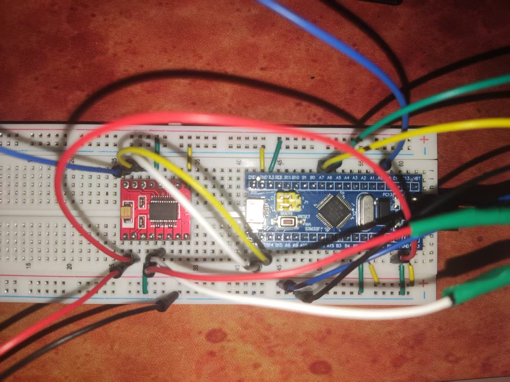

# DC-Motor-PID-Control
基于STM32F103的直流电机PID闭环调速系统

## 硬件
- STM32F103C8T6最小系统板
- TB6612电机驱动
- JGA25-370 6V减速电机（带霍尔编码器）
- 0.96寸OLED（I2C）
- 18650电池盒（7.4V）待到货，目前USB供电

## 进度
- [x] Day1 (7.28): 开环PWM，电机正反转正常
- [ ] Day2 (7.29): 占空比实验
- [ ] Day3 (7.30): 编码器测速
- [ ] Day4 (7.31): 转速计算
- [ ] Day5 (8.1): PID闭环
- [ ] Day6 (8.2): 整合演示

## 接线图

## 测试视频
[Day1 电机正转测试](Media/Day1_Motor_Run.mp4)

## 更新日志
- 2026-07-28: USB供电测试通过，电机开环运行正常
- 2026-07-28: 开环PWM占空比测试，四档转速正常